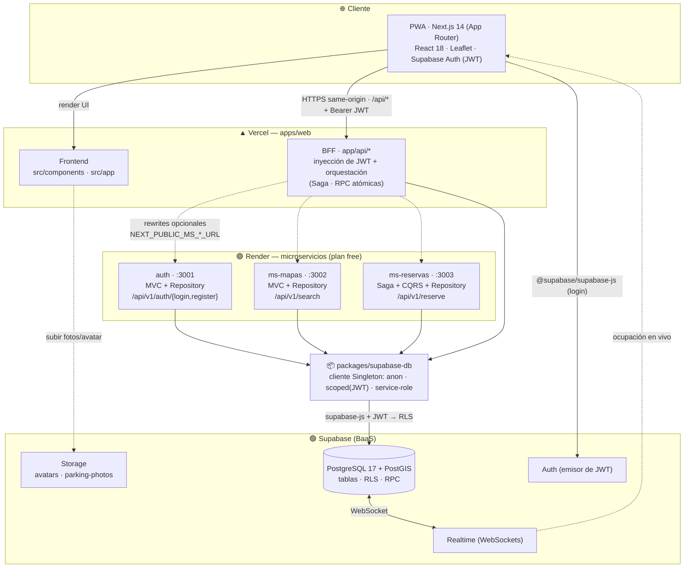
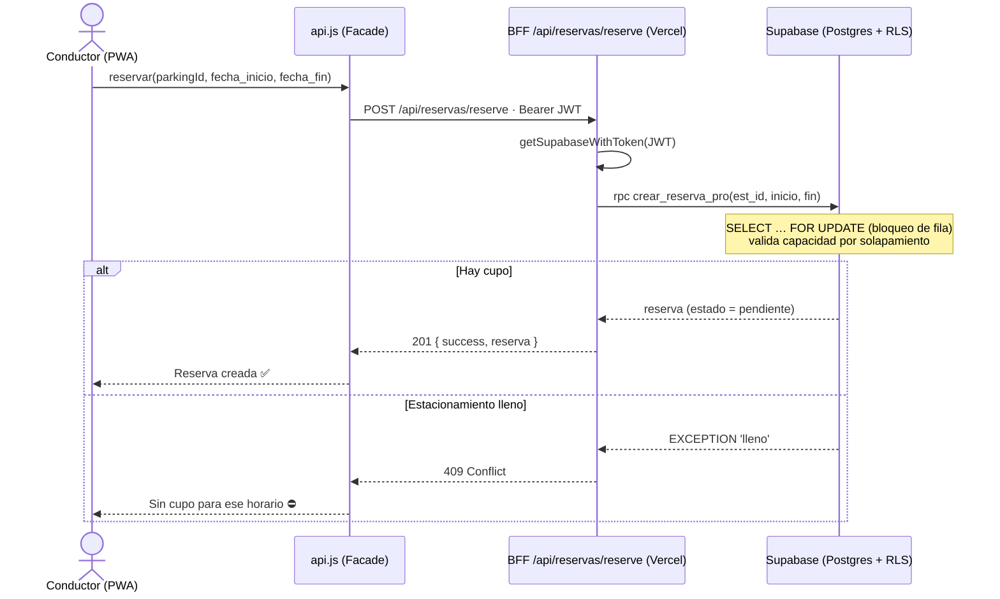
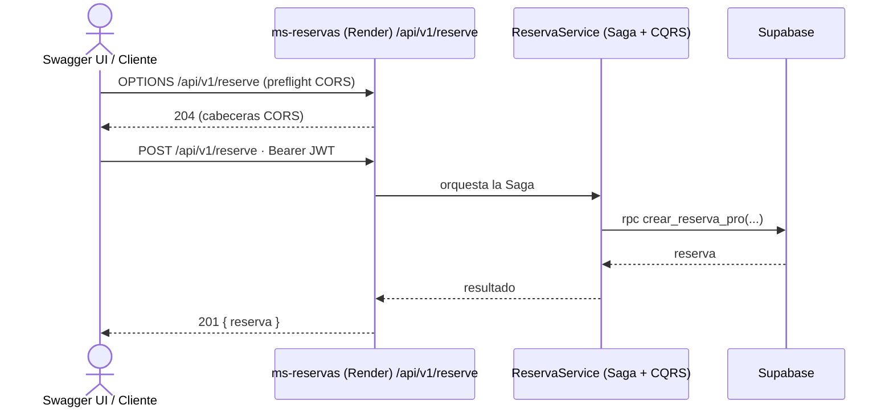

# Diagrama de Arquitectura — Parkings Together

> Documento de arquitectura del sistema. Describe el estilo arquitectónico, los
> componentes, su despliegue, la comunicación entre servicios y el modelo de
> seguridad de la plataforma **Parkings Together** (marketplace P2P de
> estacionamientos).
>
> Complementa a: [`PERSISTENCIA.md`](PERSISTENCIA.md) (modelo de datos) ·
> [`PATRONES_DISEÑO.md`](PATRONES_DISEÑO.md) (patrones) ·
> [`../repositorios.txt`](../repositorios.txt) (URLs de despliegue y APIs).

---

## 1. Resumen ejecutivo

| Aspecto | Detalle |
|---|---|
| **Estilo arquitectónico** | Microservicios + **BFF** (Backend for Frontend), sobre un **monorepo** Turborepo |
| **Frontend** | PWA Next.js 14 (App Router) + React 18 + Leaflet |
| **Backend** | 1 BFF (`apps/web/app/api`) + 3 microservicios independientes (`auth`, `ms-mapas`, `ms-reservas`) |
| **Persistencia** | Supabase = PostgreSQL 17 + PostGIS + Auth + Realtime + Storage (BaaS compartido) |
| **Despliegue** | Frontend + BFF → **Vercel** · Microservicios → **Render** · BD → **Supabase** |
| **Seguridad** | JWT (Supabase Auth) + **RLS** (Row Level Security) en cada tabla |
| **Gestión del monorepo** | Turborepo + npm workspaces (`apps/*`, `packages/*`), Node ≥ 22 |

---

## 2. Estilo arquitectónico

El sistema combina tres decisiones arquitectónicas:

1. **Monorepo (Turborepo).** Todo el código vive en un único repositorio con
   workspaces de npm. El paquete compartido `packages/supabase-db` centraliza el
   acceso a la base de datos y es consumido por las cuatro aplicaciones.

2. **Microservicios.** El dominio se divide en tres servicios desplegables de
   forma independiente, cada uno con su propia responsabilidad acotada y su
   propia API REST versionada (`/api/v1/*`):
   - **`auth`** — registro e inicio de sesión.
   - **`ms-mapas`** — catálogo y búsqueda geoespacial de estacionamientos.
   - **`ms-reservas`** — ciclo de vida de las reservas (Saga + CQRS).

3. **BFF (Backend for Frontend).** La app `apps/web` expone, bajo `app/api/*`,
   una capa de orquestación de **mismo origen** pensada para el frontend:
   inyecta el JWT del usuario, agrega/transforma respuestas y ejecuta la lógica
   de dominio contra Supabase. Evita CORS y reduce el número de llamadas del
   navegador.

### Doble vía de ejecución del dominio (clave para entender el sistema)

La misma lógica de negocio está disponible por **dos caminos equivalentes**:

| Vía | Quién ejecuta | Cómo se invoca | Uso |
|---|---|---|---|
| **BFF (primaria en producción)** | `apps/web/app/api/*` en Vercel | El frontend llama `/api/*` **same-origin** con el JWT | Camino real de la app desplegada. Los handlers hablan **directo con Supabase** (RPC atómicas, Saga). El propio código lo documenta: *«sustituye a `ms-reservas`/`ms-mapas` en runtime»*. |
| **Microservicios (independientes)** | `auth`, `ms-mapas`, `ms-reservas` en Render | API REST `/api/v1/*` (con CORS) | Servicios autónomos que **encapsulan la misma lógica** con capas explícitas (MVC + Repository / Saga + CQRS). Se documentan con **Swagger** y se prueban en vivo. Se pueden "enchufar" al BFF vía *rewrites* por variable de entorno. |

> Ambas vías terminan en la **misma** instancia de Supabase y respetan las
> mismas políticas RLS, por lo que el comportamiento del dominio es idéntico.

---

## 3. Diagrama de componentes y despliegue

**Lectura del diagrama**
- El **navegador** consume el **BFF** de mismo origen (sin CORS) y se autentica
  contra **Supabase Auth**, que emite el **JWT**.
- El **BFF** y los **microservicios** acceden a Postgres exclusivamente a través
  del paquete compartido `supabase-db`, propagando el **JWT** para que **RLS**
  evalúe `auth.uid()` con el usuario real.
- Las flechas **punteadas** BFF→microservicios representan la integración
  *opcional* por *rewrites* (se activa si están definidas las variables
  `NEXT_PUBLIC_MS_AUTH_URL`, `NEXT_PUBLIC_MS_MAPAS_URL`, `NEXT_PUBLIC_MS_RESERVAS_URL`).
- **Realtime** empuja por WebSocket los cambios de ocupación de
  `estacionamientos` para el semáforo en vivo del mapa.

---

## 4. Componentes

| Componente | Responsabilidad | Puerto (dev) | Despliegue | API pública | Patrones |
|---|---|---|---|---|---|
| **apps/web** (Frontend) | UI PWA, mapa Leaflet, dashboards por rol | 3000 | Vercel | — (UI) | Observer, Strategy, Facade |
| **apps/web** (BFF) | Orquestación same-origin, inyección de JWT, lógica de dominio | 3000 | Vercel | `/api/*` | **BFF**, Saga, Facade |
| **apps/auth** | Registro e inicio de sesión | 3001 | Render | `/api/v1/auth/login`, `/register` | MVC, Repository |
| **apps/ms-mapas** | Catálogo y búsqueda geoespacial de estacionamientos | 3002 | Render | `/api/v1/search` | MVC, Repository |
| **apps/ms-reservas** | Ciclo de vida de reservas (crear/confirmar/cancelar/calificar) | 3003 | Render | `/api/v1/reserve` | **Saga + CQRS**, Repository |
| **packages/supabase-db** | Cliente Supabase compartido (anon / scoped / service-role) | — | (librería) | — | **Singleton** |

### Endpoints del BFF (`apps/web/app/api`)

| Recurso | Métodos | Función |
|---|---|---|
| `auth/signup` | POST | Alta de usuario (delega en Supabase Auth) |
| `mapas/search` | GET · POST · PATCH · DELETE | Buscar/crear/editar/eliminar estacionamientos (búsqueda geo vía RPC PostGIS) |
| `mapas/locks` | GET · POST · DELETE | Bloqueos temporales de plaza |
| `reservas/reserve` | GET · POST | Disponibilidad y creación de reserva (Saga + RPC) |
| `reservas/manage` | GET · PATCH | Gestión de reservas (confirmar, cancelar, completar, calificar, reprogramar) |
| `favoritos` | GET · POST · DELETE | Estacionamientos favoritos del usuario |
| `pagos` | POST | Pagos (Strategy: Mock / Efectivo / Webpay) |
| `premium` | GET · POST | Suscripción premium |
| `reseñas` | GET | Reseñas (derivadas de `reservas` calificadas) |
| `support/chat` | POST | Chat de soporte |

---

## 5. Comunicación entre servicios

### Mecanismos
- **Navegador → BFF:** HTTPS de **mismo origen** a `/api/*`. El JWT viaja en la
  cabecera `Authorization: Bearer <token>`.
- **BFF → microservicios (opcional):** *rewrites* de Next.js definidos en
  `apps/web/next.config.mjs`, activados sólo en producción cuando están las
  variables `NEXT_PUBLIC_MS_*_URL`. Permiten redirigir `/api/auth|mapas|reservas`
  hacia los microservicios desplegados en Render.
- **Servicios → Supabase:** `@supabase/supabase-js` propagando el JWT del
  usuario (RLS) o, sólo en servidor, la *service-role key* para operaciones
  administrativas puntuales (p. ej. crear el perfil tras el registro).
- **Supabase → Navegador:** **Realtime** (WebSocket) para la ocupación en vivo.

### Flujo: crear una reserva (vía BFF, producción)

### Flujo: prueba en vivo de un microservicio (Swagger → Render)

> ⚠️ **Render (plan free):** los microservicios se suspenden tras ~15 min de
> inactividad; la **primera** petición tras la suspensión tarda ~30–60 s en
> responder («cold start»). Para una demo o defensa, conviene abrir las URLs unos
> minutos antes para "despertarlos".

---

## 6. Microservicios independientes y documentación Swagger

Cada microservicio:
- Expone una **API REST versionada** (`/api/v1/*`) con manejadores **CORS**
  (`OPTIONS`), de modo que pueden invocarse desde otro origen (incluido el
  botón *Try it out* de Swagger).
- Implementa una **arquitectura por capas** explícita:
  `Controller → Service → Repository → supabase-db`.
- Persiste en la **misma** base de datos Supabase (ver `PERSISTENCIA.md`).

Las **URLs públicas de despliegue** (Render) y los **links de cada API** se
listan en [`../repositorios.txt`](../repositorios.txt); el `servers:` de cada
documento OpenAPI/Swagger apunta a esas URLs para permitir pruebas en vivo.

---

## 7. Stack tecnológico

| Capa | Tecnología | Uso |
|---|---|---|
| Frontend | Next.js 14 (App Router), React 18 | PWA, SSR/CSR, hooks |
| Mapas | Leaflet / react-leaflet | Mapa interactivo, capa térmica en `<canvas>` |
| Estilos | styled-jsx + CSS global (TailwindCSS) | UI "Neon Glassmorphism" |
| Backend | Route Handlers de Next.js (Node runtime) | BFF + microservicios |
| Datos | Supabase: PostgreSQL 17, PostGIS, Auth, Realtime, Storage | Persistencia, autenticación, tiempo real, archivos |
| Acceso a datos | `@supabase/supabase-js` (paquete `supabase-db`) | Cliente Singleton + RPC |
| Monorepo | Turborepo + npm workspaces | Build cacheado, dev en paralelo |
| Despliegue | Vercel (web/BFF) · Render (microservicios) | CI/CD |
| Tests | Jest + Testing Library | Unitarios e integración |

---

## 8. Patrones de diseño

Resumen (detalle en [`PATRONES_DISEÑO.md`](PATRONES_DISEÑO.md)):

| Patrón | Categoría | Ubicación |
|---|---|---|
| BFF | Arquitectural | `apps/web/app/api/` |
| Repository | Arquitectural | `apps/*/src/repositories/*.repository.js` |
| Service Layer | Arquitectural | `apps/*/src/services/*.service.js` |
| Controller (MVC) | Arquitectural | `apps/ms-mapas/src/controllers/`, `apps/auth/src/` |
| Saga + CQRS | Comportamental | `apps/ms-reservas/.../services/reserva.service.js` |
| Observer | Comportamental | `apps/web/src/components/Navbar.js` |
| Strategy | Comportamental | `apps/web/src/lib/payments.js` |
| Singleton | Creacional | `packages/supabase-db/index.js` |
| Facade | Estructural | `apps/web/src/lib/api.js` |

---

## 9. Seguridad

- **Autenticación:** Supabase Auth emite un **JWT** por usuario. El frontend lo
  adjunta como `Bearer` en cada llamada al BFF/microservicios.
- **Autorización a nivel de fila (RLS):** *todas* las tablas de `public` tienen
  **Row Level Security** activado. El acceso se hace con un cliente *scoped* al
  JWT (`getSupabaseWithToken`), de modo que las políticas evalúan
  `auth.uid() = usuario real`. Ningún usuario puede leer/escribir datos ajenos.
- **Operaciones atómicas seguras:** la lógica sensible (reservar, confirmar,
  cancelar, calificar) vive en **funciones RPC `SECURITY DEFINER`** con
  `REVOKE … FROM public, anon` y `GRANT EXECUTE … TO authenticated`, validando
  internamente `auth.uid()`.
- **Service-role aislada:** la clave de *service-role* (bypassa RLS) **sólo** se
  instancia en servidor; `supabase-db` lanza un error si se intenta crear en el
  navegador.

---

## 10. Notas de operación y escalabilidad

- **Cold start de Render (plan free):** ver aviso en la sección 5.
- **Búsqueda geoespacial:** `ms-mapas`/BFF usan la RPC PostGIS
  `buscar_estacionamientos_radio` (índice GIST) para búsqueda por radio en
  O(log n); existe un *fallback* en memoria (Haversine) para casos sin geo.
- **Tiempo real:** la tabla `estacionamientos` está en la publicación
  `supabase_realtime`; los clientes reciben los cambios de ocupación por
  WebSocket sin *polling*.
- **Caché de búsqueda:** las respuestas de búsqueda geo se sirven con
  `Cache-Control: public, max-age=20, stale-while-revalidate=60`.
