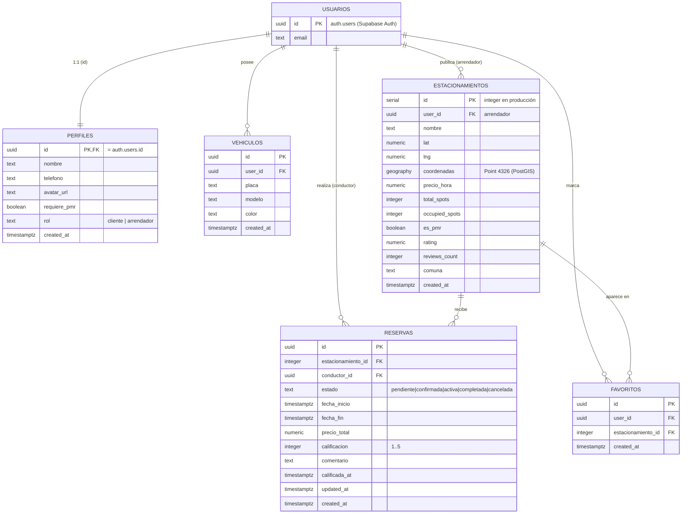
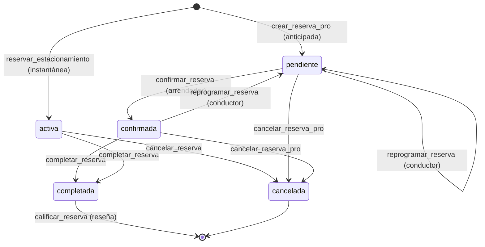

# Documentación de Persistencia — Parkings Together

> Describe **cómo y dónde** persiste los datos la plataforma: motor, estrategia
> de acceso, modelo entidad-relación, tablas, políticas de seguridad (RLS),
> funciones almacenadas (RPC), *triggers*, *storage* e integridad/concurrencia.
>
> Complementa a [`DIAGRAMA_ARQUITECTURA.md`](DIAGRAMA_ARQUITECTURA.md).
> Fuentes canónicas en el repo: [`../supabase_schema.sql`](../supabase_schema.sql)
> y las migraciones de [`../sql/`](../sql) (`001`–`012`, `APLICAR_TODO.sql`) y
> [`../packages/supabase-db/migrations/`](../packages/supabase-db/migrations).

---

## 1. Motor de persistencia

Toda la persistencia se concentra en **Supabase**, un BaaS sobre **PostgreSQL 17**:

| Subsistema | Tecnología | Uso en el proyecto |
|---|---|---|
| Base de datos | PostgreSQL 17 | Datos relacionales del dominio (esquema `public`) |
| Geoespacial | **PostGIS** | Columna `geography(Point,4326)` + búsqueda por radio con índice GIST |
| Autenticación | Supabase Auth | Tabla `auth.users` (gestionada por Supabase); emite JWT |
| Tiempo real | Realtime | Publicación `supabase_realtime` (ocupación en vivo) |
| Archivos | Storage | *Buckets* `avatars` y `parking-photos` |

Es una **base de datos única y compartida**: el BFF y los tres microservicios
escriben/leen sobre el mismo esquema (ver §11).

---

## 2. Estrategia de acceso a datos

### 2.1. Cliente compartido (`packages/supabase-db`, patrón Singleton)

Expone tres formas de acceso, todas sobre la misma URL de Supabase:

| Export | Llave | RLS | Dónde se usa |
|---|---|---|---|
| `supabase` | *anon* | ✅ activo | Lecturas públicas (p. ej. catálogo de estacionamientos) |
| `getSupabaseWithToken(jwt)` | *anon* + `Authorization: Bearer <jwt>` | ✅ activo, `auth.uid()` = usuario real | Escrituras del usuario en route handlers (servidor) |
| `getServiceSupabase()` | *service-role* | ⛔ **bypassa RLS** | **Sólo servidor**; operaciones administrativas puntuales |

> Salvaguarda: `getServiceSupabase()` lanza un error si se invoca en el
> navegador (`typeof window !== 'undefined'`), evitando exponer privilegios.

### 2.2. Patrones de persistencia

- **Repository:** cada microservicio encapsula su acceso a datos en
  `src/repositories/*.repository.js` (p. ej. `MapRepository`, `AuthRepository`).
- **RPC (procedimientos almacenados):** las operaciones con invariantes de
  concurrencia (reservar, confirmar, cancelar, reprogramar, calificar,
  completar) se ejecutan como funciones **PL/pgSQL `SECURITY DEFINER`** que
  serializan el acceso con bloqueos de fila `SELECT … FOR UPDATE` (ver §7 y §10).
- **RLS por defecto:** todas las tablas de `public` tienen Row Level Security
  activado; el aislamiento entre usuarios se garantiza en la base de datos, no
  sólo en la aplicación.

---

## 3. Modelo Entidad-Relación

> **Nota sobre tipos de clave:** en producción `estacionamientos.id` es
> `serial`/`integer` (no `uuid`); por eso `reservas.estacionamiento_id` y
> `favoritos.estacionamiento_id` son `integer`, y el código coacciona con
> `Number(id)` antes de invocar las RPC. `perfiles.id` es a la vez **PK y FK**
> hacia `auth.users(id)` (relación 1:1).

---

## 4. Detalle de tablas

### 4.1. `perfiles` — perfil público (1:1 con `auth.users`)

| Columna | Tipo | Notas |
|---|---|---|
| `id` | uuid | **PK**, FK → `auth.users(id)` `ON DELETE CASCADE` |
| `nombre` | text | NOT NULL |
| `telefono` | text | |
| `avatar_url` | text | apunta al *bucket* `avatars` |
| `requiere_pmr` | boolean | default `false` |
| `rol` | text | NOT NULL, default `'cliente'`, CHECK ∈ {`cliente`,`arrendador`} |
| `created_at` | timestamptz | default `now()` |

**RLS** (todas sobre la propia fila): `SELECT`/`INSERT`/`UPDATE` con
`auth.uid() = id`.
**Trigger:** `on_auth_user_created` → `handle_new_user()` crea el perfil
automáticamente al registrarse un usuario (toma `nombre`/`rol` de
`raw_user_meta_data`).

### 4.2. `vehiculos`

| Columna | Tipo | Notas |
|---|---|---|
| `id` | uuid | **PK**, default `gen_random_uuid()` |
| `user_id` | uuid | NOT NULL, FK → `auth.users(id)` CASCADE |
| `placa` | text | NOT NULL |
| `modelo` | text | NOT NULL |
| `color` | text | NOT NULL |
| `created_at` | timestamptz | default `now()` |

**RLS:** CRUD completo restringido a `auth.uid() = user_id`.
*(La migración `012_vehiculo_principal.sql` añade el concepto de vehículo
principal del usuario.)*

### 4.3. `estacionamientos`

| Columna | Tipo | Notas |
|---|---|---|
| `id` | serial | **PK** (integer en producción) |
| `user_id` | uuid | FK → `auth.users(id)` CASCADE (arrendador) |
| `nombre` | text | NOT NULL |
| `arrendador` | text | nombre visible del arrendador |
| `lat`, `lng` | numeric | NOT NULL |
| `coordenadas` | geography(Point,4326) | PostGIS, para búsqueda por radio |
| `precio_hora` | numeric | default `0` |
| `total_spots` | integer | NOT NULL, default `1` |
| `occupied_spots` | integer | NOT NULL, default `0` |
| `es_pmr` | boolean | default `false` |
| `rating` | numeric | default `0` (agregado de reseñas) |
| `reviews_count` | integer | default `0` |
| `comuna` | text | |
| `created_at` | timestamptz | default `now()` |

**Constraint:** `CHECK (occupied_spots >= 0 AND occupied_spots <= total_spots)`.
**Índice:** `idx_estacionamientos_user_id (user_id)`.
**RLS:**
- `SELECT`: pública — `USING (true)`.
- `INSERT`: sólo si `auth.uid() = user_id` **y** el perfil tiene `rol = 'arrendador'`.
- `UPDATE`/`DELETE`: sólo el dueño (`auth.uid() = user_id`).

**Realtime:** incluida en la publicación `supabase_realtime`.

### 4.4. `reservas`

| Columna | Tipo | Notas |
|---|---|---|
| `id` | uuid | **PK**, default `gen_random_uuid()` |
| `estacionamiento_id` | integer | NOT NULL, FK → `estacionamientos(id)` CASCADE |
| `conductor_id` | uuid | NOT NULL, FK → `auth.users(id)` |
| `estado` | text | default `'pendiente'`, CHECK ∈ {`pendiente`,`confirmada`,`activa`,`completada`,`cancelada`} |
| `fecha_inicio`, `fecha_fin` | timestamptz | ventana de la reserva PRO |
| `precio_total` | numeric | calculado: horas × `precio_hora` |
| `calificacion` | integer | CHECK 1..5 (reseña) |
| `comentario` | text | reseña |
| `calificada_at` | timestamptz | |
| `updated_at` | timestamptz | NOT NULL, mantenido por *trigger* |
| `created_at` | timestamptz | default `now()` |

**Constraints:** `fecha_fin > fecha_inicio`; `calificacion BETWEEN 1 AND 5`.
**Índices:** `(estacionamiento_id, fecha_inicio, fecha_fin)` y `(conductor_id)`.
**Trigger:** `trg_reservas_updated_at` → `touch_updated_at()`.
**RLS:**
- Conductor (dueño de la reserva): `SELECT`/`INSERT`/`UPDATE`/`DELETE` con
  `auth.uid() = conductor_id`.
- Arrendador (dueño del estacionamiento): `SELECT`/`UPDATE` si existe el
  estacionamiento con `e.user_id = auth.uid()`.

### 4.5. `favoritos`

| Columna | Tipo | Notas |
|---|---|---|
| `id` | uuid | **PK**, default `gen_random_uuid()` |
| `user_id` | uuid | NOT NULL, FK → `auth.users(id)` CASCADE |
| `estacionamiento_id` | integer | NOT NULL, FK → `estacionamientos(id)` CASCADE |
| `created_at` | timestamptz | default `now()` |

**Constraint:** `UNIQUE (user_id, estacionamiento_id)` (no se duplican).
**Índice:** `idx_favoritos_user (user_id)`.
**RLS:** `SELECT`/`INSERT`/`DELETE` con `auth.uid() = user_id`.

---

## 5. Reseñas y calificaciones (modelo)

No existe una tabla `reseñas` independiente: una **reseña es una `reserva`
calificada**. El conductor califica una reserva en estado `completada`
(`calificacion` 1–5 + `comentario`), y la RPC `calificar_reserva` **recalcula**
el agregado en el estacionamiento:

- `estacionamientos.rating` = promedio de `calificacion`.
- `estacionamientos.reviews_count` = número de reservas calificadas.

El endpoint `GET /api/reseñas` del BFF deriva las reseñas de `reservas`.

---

## 6. Columnas adicionales en producción

El código de la aplicación usa columnas que amplían el esquema canónico
(añadidas por migraciones posteriores y/o desde el panel de Supabase). Conviene
documentarlas para una imagen fiel del estado real:

- **`estacionamientos`:** `activo` (boolean; *soft-delete* y ocultar de la
  búsqueda pública), `photos text[]` (galería; *bucket* `parking-photos`),
  `price_per_minute`, `price_per_day`, `allowed_vehicle_types text[]`,
  `descripcion`, `direccion`.
- **`reservas`:** `spot_label` (etiqueta de plaza asignada).

> Fuente de verdad operativa: el esquema vivo en Supabase. El archivo
> `supabase_schema.sql` documenta el núcleo (perfiles, vehículos,
> estacionamientos, reservas, favoritos, RLS y Realtime).

---

## 7. Funciones almacenadas (RPC)

Todas son **PL/pgSQL**, `SECURITY DEFINER`, con `search_path = public`,
`REVOKE … FROM public, anon` y `GRANT EXECUTE … TO authenticated`. Validan
`auth.uid()` internamente y usan `SELECT … FOR UPDATE` para serializar el
control de capacidad.

| Función | Firma | Propósito | Autorización interna |
|---|---|---|---|
| `reservar_estacionamiento` | `(p_estacionamiento_id int)` | Reserva **instantánea**: bloquea fila, valida `occupied < total`, inserta reserva `activa` e incrementa `occupied_spots` | Usuario autenticado (conductor) |
| `crear_reserva_pro` | `(p_estacionamiento_id int, p_fecha_inicio ts, p_fecha_fin ts)` | Reserva **anticipada**: valida solapamiento vs `total_spots`, calcula `precio_total`, inserta `pendiente` | Conductor autenticado |
| `confirmar_reserva` | `(p_reserva_id uuid)` | `pendiente → confirmada` | Sólo el **arrendador** dueño del estacionamiento |
| `cancelar_reserva` | `(p_reserva_id uuid)` | Cancela una reserva **instantánea** y libera el cupo (`occupied_spots − 1`) | Sólo el conductor dueño |
| `cancelar_reserva_pro` | `(p_reserva_id uuid)` | Cancela reserva PRO (`→ cancelada`) | Conductor dueño **o** arrendador del espacio |
| `reprogramar_reserva` | `(p_reserva_id uuid, p_fecha_inicio ts, p_fecha_fin ts)` | Cambia la ventana revalidando capacidad; vuelve a `pendiente` | Sólo el conductor dueño |
| `completar_reserva` | `(p_reserva_id uuid)` | `confirmada/activa → completada` | Conductor **o** arrendador |
| `calificar_reserva` | `(p_reserva_id uuid, p_calificacion int, p_comentario text)` | Califica reserva `completada` y recalcula `rating`/`reviews_count` | Sólo el conductor dueño |
| `buscar_estacionamientos_radio` | `(p_lat, p_lng, p_radio_km, p_q, p_comuna, p_pmr, p_precio_max, p_disponible)` | Búsqueda geoespacial **PostGIS** por radio (índice GIST) | Lectura pública |

**Estados de una reserva (máquina de estados):**

---

## 8. Triggers

| Trigger | Tabla | Función | Efecto |
|---|---|---|---|
| `on_auth_user_created` | `auth.users` (AFTER INSERT) | `handle_new_user()` | Crea el `perfil` del nuevo usuario |
| `trg_reservas_updated_at` | `reservas` (BEFORE UPDATE) | `touch_updated_at()` | Actualiza `updated_at = now()` |
| `on_perfiles_updated` | `perfiles` (BEFORE UPDATE) | `handle_updated_at()` | Mantiene `updated_at` (variante histórica) |

---

## 9. Storage (archivos)

| Bucket | Visibilidad | Reglas |
|---|---|---|
| `avatars` | público (lectura) | Límite 5 MB; MIME `png/jpeg/webp`. *Upload/Update/Delete* sólo el dueño, en su carpeta `userId/*` (`storage.foldername(name)[1] = auth.uid()`) |
| `parking-photos` | (galería de estacionamientos) | URLs guardadas en `estacionamientos.photos text[]` |

---

## 10. Integridad y concurrencia

- **Integridad referencial:** claves foráneas con `ON DELETE CASCADE`
  (borrar un usuario/estacionamiento arrastra sus filas dependientes).
- **Invariantes por CHECK:** `occupied_spots ∈ [0, total_spots]`,
  `fecha_fin > fecha_inicio`, `calificacion ∈ [1,5]`, `rol`/`estado` con
  dominios cerrados.
- **Unicidad:** un usuario no puede marcar dos veces el mismo favorito
  (`UNIQUE(user_id, estacionamiento_id)`).
- **Concurrencia (anti doble-reserva):** las RPC bloquean la fila del
  estacionamiento con `SELECT … FOR UPDATE` antes de contar cupos/solapamientos,
  serializando reservas concurrentes sobre el mismo espacio. Es el mecanismo que
  da consistencia a la **Saga** de reservas (insertar reserva → ajustar
  ocupación → compensar si falla).
- **Aislamiento por RLS:** ningún cliente puede leer/escribir filas de otro
  usuario, incluso si la aplicación tuviera un fallo (defensa en profundidad).

---

## 11. Persistencia por servicio

Todos los servicios persisten en la **misma** base de datos Supabase mediante el
paquete compartido `@parkings/supabase-db`:

| Servicio | Lee/escribe | Mecanismo |
|---|---|---|
| **BFF** (`apps/web/app/api`) | `estacionamientos`, `reservas`, `favoritos`, `perfiles`, storage | `getSupabaseWithToken(jwt)` + RPC (`crear_reserva_pro`, `reservar_estacionamiento`, `buscar_estacionamientos_radio`, …) |
| **auth** | `auth.users` (Supabase Auth) + `perfiles` | `supabase.auth.signUp/signInWithPassword`; crea el perfil con *service-role* si el trigger no lo hizo |
| **ms-mapas** | `estacionamientos` | `MapRepository` → `supabase.from('estacionamientos')` (CRUD + ocupación) |
| **ms-reservas** | `reservas`, `estacionamientos` | `ReservaService` (Saga + CQRS) → RPC de reservas |

> Como la base es compartida, una reserva creada por el microservicio o por el
> BFF es **inmediatamente** visible para ambos y para el mapa en tiempo real.
